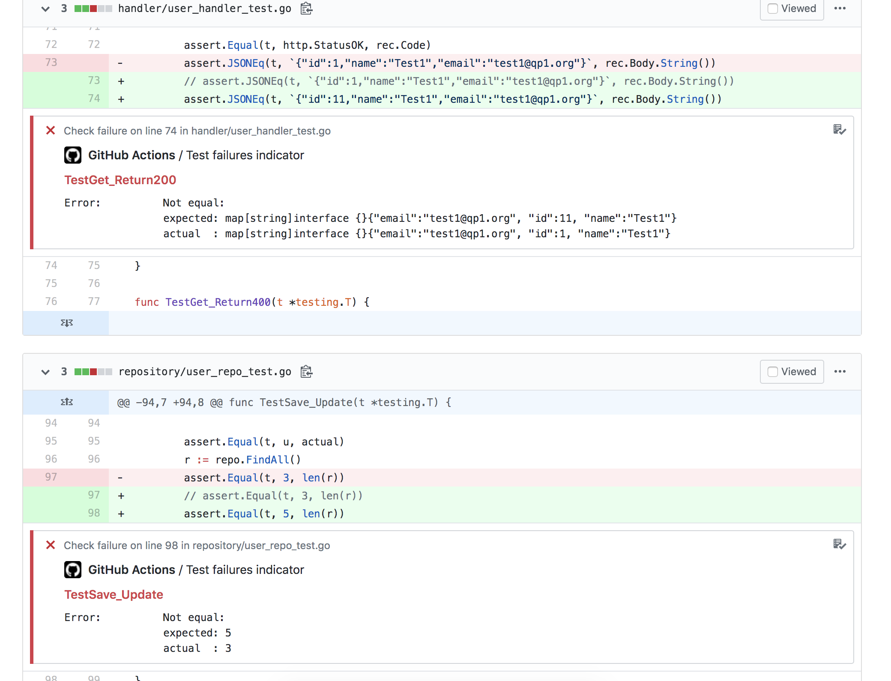
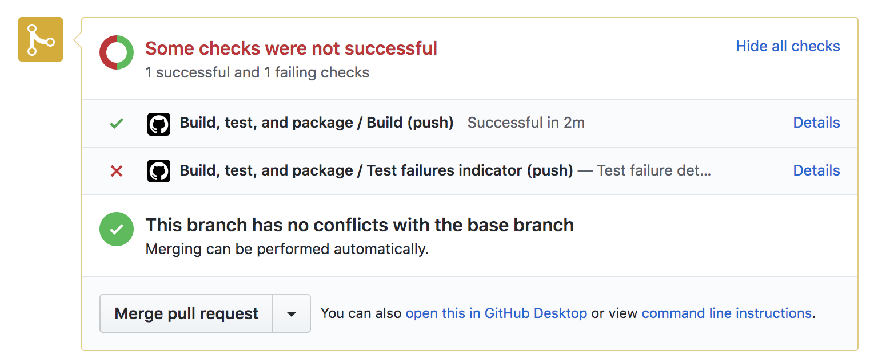
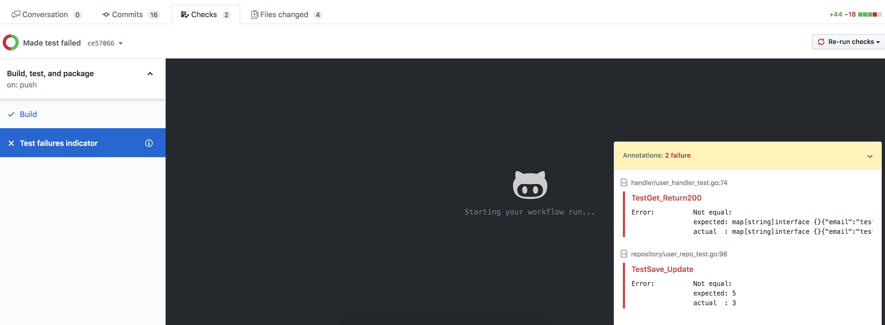

Go Test Failure Annotator
===
This action annotates where the test failures are. The current version supports only Go test. To support more test results needs to implement the test result parser (interface: `service.TestResultParser` )






## Environment variables the action uses
The following table describes what the environment variables the action required

| Env. Name | Description | e.g. |
|---|---|---|
| TEST_RESULT | File path of the test result | `/test-results/test_report.xml` |
| GITHUB_API_URL | URL of GitHub check run API | `https://api.github.com` |
| GITHUB_TOKEN | The GITHUB_TOKEN secret is a GitHub App installation token scoped to the repository that contains your workflow | |
| GITHUB_SHA * | The commit SHA that triggered the workflow | `ffac537e6cbbf934b08745a378932722df287a53` |
| GITHUB_WORKSPACE * | Actions execute in this directory | `/github/workspace` |
| GITHUB_REPOSITORY * | The owner and repository name | `octocat/Hello-World` |

<em>* Default environment variables</em>


## How to use your action in a workflow
Please find the following example for your GitHub workflow

```
    - name: Annotate test failures
      uses: rockychen-ef/go-test-failure-annotator@v1.0.1
      env:
        TEST_RESULT: /test-results/test_report.xml
        GITHUB_API_URL: https://api.github.com
        GITHUB_TOKEN: ${{ secrets.GITHUB_TOKEN }}
```